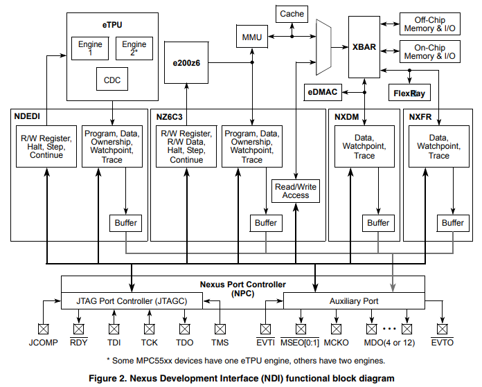

> Qorivva MPC56xx Flash Programming Through Nexus/JTAG
# Qorivva MPC56xx系列 Nexus/JTAG闪存编程
> The Qorivva MPC56xx family of devices has internal
flash memory used for code and data. The MPC56xx
Nexus debug interface can be used to program flash
memory using the JTAG communication protocol
through the JTAG port. This allows programming of the
internal flash memory with an external tool.

Qorivva MPC56xx系列芯片拥有用于存储代码和数据的内建闪存。MPC56xx的Nexus调试接口可以用来为闪存编程，这需要连通JTAG接口，使用JTAG协议。这就是说可以通过外部工具对内建闪存进行编程。
> All MPC56xx devices have versions of the e200zx core
that support variable length encoding (VLE)
instructions. Most MPC56xx devices support both Book
E and VLE instructions; however, some MPC560x
devices utilize the e200z0 core that only supports VLE
instructions. Table 9 shows the core types used on
currently available MPC56xx devices. However, as
different variations of the MPC56xx family will be
released during the lifecycle of this document, it is
important that you confirm the core type on the target
MPC56xx device. For the remainder of this document,
code examples are provided in Book E. If the instruction
example differs when implemented in VLE, the
equivalent VLE instruction is also shown in brackets. 

所有MPC56xx系列芯片都包含一个支持变长编码指令集（下文称VLE）的e200zx内核。大多数MPC56xx系列芯片支持Book E和VLE两种指令集，一些使用了e200z0内核的芯片仅支持VLE指令集。`表9`列出了所有已发布芯片的内核型号，然而在本文档存续期间发布的新型号MPC56xx芯片不会被包含，请另行确认。本文中所有示例代码都会都以Book E指令集编写，如果对应的VLE指令与之不同会在其后的括号中提供。
> For further information on VLE, please consult VLEPM, Variable-Length Encoding (VLE) Programming
Environments Manual, available from freescale.com.

想进一步了解VLE指令集请参阅VLEPM（可以在freescale.com下载）

> This application note is adapted from AN3283, “MPC5500 Flash Programming Through Nexus/JTAG.” It
first addresses the JTAG and Nexus communication protocol. The JTAG discussion includes the JTAG
signals, TAP controller state machine, and the JTAG controller. The explanation of Nexus includes the
on-chip emulation (OnCE) module and the Nexus read/write (R/W) access block. As different versions of
the MPC56xx devices may use different JTAG and Nexus modules, the examples given here are generic
to suit this flash memory programming note. If more detailed information is required for a specific device,
please consult the reference manual.

这篇文档改编自最早阐述Nexus/JTAG通信协议的文章《MPC5500 Nexus/JTAG闪存编程》(AN3283).JTAG部分讨论了包括JTAG信号（JTAG signals）、TAP状态机和JTAG控制器。Nexus部分解释了仿真模块（OnCE）和Nexus块读写（Nexus R/W）。不同型号的MPC56xx系列芯片使用了不同的JTAG、Nexus模块，但是我们的示例代码仅适用于通用的flash。想了解某特定型号芯片的特性，请自行查看参考手册。
> After the communication protocols are described, this document goes into the details of the
Freescale-provided flash memory drivers and the requirements of the external tool for flash programming.
For the purpose of this document, the external tool consists of a PC application combined with interface
hardware that connects the PC to the JTAG port on an MPC56xx board or module.

解释通信协议后，本文档会进一步详解Freescale的flash设备和flash编程的外部工具需求。flash编程的外部工具即包含了软件，也包含了PC与MPC56xx系列芯片的JTAG链接的硬件接口
> This document is intended for anyone wanting to develop a flash memory programming tool for the
MPC56xx family of devices. Someone wanting to learn about the JTAG communication protocol, OnCE
module, or the Nexus R/W access block may also find this application note beneficial.

本文适用于所有有意向开发MPC56xx系列芯片的flash开发工具的人员，同时对想了解JTAG通信协议、仿真模块（OnCE）和Nexus块读写技术的开发在也有帮助。

>1 JTAG  JTAG is a serial communication protocol developed by the Joint Test Access Group. Originally developed
for boundary scan, JTAG is also used for communication with the Nexus debug interface (NDI) on the
MPC56xx devices. Figure 2 shows a block diagram of the NDI.

## 1 JTAG
JTAG是一系列有Joint Test Access Group开发的通信协议，其最初是用来做边界扫描（boundary scan）。同时JTAG也用作与MPC56xx系列芯片的NDI接口（Nexus debug interface）通信。`图2`显示了NDI的结构图。
>1.1 JTAG signals The JTAG port of the MPC56xx devices consists of the TCK, TDI, TDO, TMS, and JCOMP pins. TDI,TDO, TMS, and TCK are compliant with the IEEE 1149.1-2001 standard and are shared with the NDI through the test access port (TAP) interface. See Table 1 for signal properties. 

### 1.1 JTAG 信号（1.1 JTAG signals）
MPC56xx系列芯片的JTAG端口由 *TCK*, *TDI*, *TDO*, *TMS*, and *JCOMP* 引脚组成。其中*TCK*, *TDI*, *TDO*, *TMS*接口符合`IEEE 1149.1-2001`标准，同时这些针脚通过TAP接口可以与NDI共用。`表1`列出了引脚的定义。

*`表1`JTAG信号*
|名称|输入or输出|功能|说明
|:-:|:-:|:-:|:-:|
|*TCK*|输入|时钟| |
|*TDI*|输入|数据输入| |
|*TDO*|输出|数据输出| |
|*TMS*|输入|模式选择| |
|*JCOMP*|输入|JTAG Compliancy|没有此引脚的芯片JTAG依旧可用，仅在5个时钟周期TMS高电位的情况下被重置|
|*RDY*|输出|Nexus/JTAG Ready|没有此引脚的芯片无法加速Nexus块转移操作|

>1.2 TAP controller state machine
The TAP controller state machine controls the JTAG logic. The TAP controller state machine is a 16-state
finite state machine (FSM) as shown in Figure 1. The TCK and TMS signals control transition between
states of the FSM. These two signals control whether an instruction register scan or data register scan is
performed. Both the TDI and TMS inputs are sampled on the rising edge of TCK while the TDO output
changes on the falling edge of TCK. The value shown next to each state of the state machine in Figure 1
is the value of TMS required on the rising edge of TCK to transition to the connected state. Five rising
edges of TCK with TMS at logic 1 guarantees entry into the TEST LOGIC RESET state.

### 1.2 TAP状态机
TAP状态机控制着JTAG逻辑。TAP状态机是有16个状态的有限状态机(FSM)，见`图1`。*TCK*和*TMS*信号共同控制着其状态的转换，同时也控制着是扫描指令寄存器还是数据寄存器。在*TCK*时钟上行期间会对*TDI*、*TMS*同时进行采样，下行期间改变改变*TDO*的输出。`图1`中显示了从当前状态切换到相关状态，所需在*TCK*时钟周期上行期间的*TMS*输入。从图中还可以看出不管当前是什么状态，*TMS*连续5个输入逻辑1都可以确保状态会切换到`TEST LOGIC RESET`,即重置状态。

>1.3 JTAG Controller (JTAGC) The devices in the MPC56xx family have a JTAG controller (JTAGC) that enables both boundary scan and
communication with the Nexus Development Interface (NDI). A block diagram of the NDI is shown in
Figure 2.

## 1.3 JTAG控制器 (JTAGC)
MPC56xx系列芯片都包含一个JTAG控制器(JTAGC)。通过JTAG控制器可以进行边界扫描（boundary scan）和与NDI（Nexus Development Interface）通信。`图2`为NDI的结构图：

>1.3.1 JTAGC reset The JTAGC is placed in reset when the TAP controller state machine is in the test logic reset state. The test
logic reset state is entered upon the assertion of the power-on reset signal, negation of JCOMP, or through
TAP controller state machine transitions controlled by TMS. Asserting power-on reset or negating JCOMP
results in asynchronous entry into the test logic reset state.
In devices without a JCOMP pin, the JTAGC is always enabled and can only be reset by clocking TCK
five times with TMS high. See AN4088, “MPC5500/MPC5600 Nexus Support Overview” for a table of
devices that implement the JCOMP pin.

### 1.3.1 重置JTAGC(JTAG控制器)
当TAP控制器的状态机处于`TEST LOGIC RESET`时，JTAGC就会被重置。只有接通电源和*JCOMP*异步输入导致的否定结果(negating JCOMP results)。

在没有*JCOMP*引脚的芯片上，JTAGC只能通过连续5次*TMS*输入逻辑1来重置。是否实现了*JCOMP*引脚，请参见*AN4088*《MPC5500/MPC5600 Nexus Support Overview》。

>1.3.2 TAP sharing
The JTAGC allows communication with the NDI by sharing the test access port (TAP) with other TAP
controllers. The JTAGC initially has control of the TAP after the assertion of power-on reset or the
negation of JCOMP. As an example, selectable NDI TAP controllers for the MPC5674F include the Nexus
port controller, e200z7 OnCE, eTPU Nexus, and eDMA Nexus. The NDI TAP controllers are selected by
loading the appropriate opcode into the 5-bit instruction register of the JTAGC while JCOMP is asserted.
Table 2 shows the opcodes for the selectable TAP controllers. The JTAGC instructions available will vary
slightly depending on the core type of the MPC56xx device being programmed; however, the important
factor in the context of this flash memory programming note is that the ACCESS_AUX_TAP_ONCE
opcode is the same on all MPC56xx devices. For further details on the device-specific JTAGC instructions,
please consult the individual reference manual

### 1.3.2 TAP共享
JTAGC允许通过与其他TAP控制器共享的TAP接口。对NDI进行通信。接通电源或*JCOMP*否定后，JTAGC首先获得TAG的控制权。举例来说，MPC5674F型号的芯片的可选NDI TAP控制器包括Nexus控制器、e200z7 OnCE、e200z7 OnCE、 eTPU Nexus和 eDMA Nexus。*JCOMP*断言时，JTAGC的5位指令寄存器会读入操作码，并以此选择操作码对应的TAP控制器。`表2`列明了部分可选TAP控制器的操作码。MPC56xx系列芯片所支持的JTAGC操作码取决于其内核的版本，然而`ACCESS_AUX_TAP_ONCE`指令却是所有型号的芯片都支持的。要详细了解每种芯片所支持的JTAGC操作码，请查询相应的参考手册。

>When one of these opcodes is loaded, control of the TAP pins is transferred to the selected auxiliary TAP
controller. Any data input via TDI and TMS is passed to the selected TAP controller, and any TDO output
from the selected TAP controller is sent back to the JTAGC to be output on the TDO pin.

JTAGC操作码呗加载后，TAP引脚的控制权就转移到给被选中的辅助TAP控制器了。任何通过*TDI*和*TMS*引脚输入的数据都会转发到被选中的辅助TAP控制器，同时输出数据也会被回传给JTAGC*TDO*引脚，作为输出端。

>The JTAGC regains control of the TAP during the UPDATE-DR state if the PAUSE-DR state was entered.
Auxiliary TAP controllers are held in RUN-TEST/IDLE while they are inactive. This document will focus
on the OnCE TAP controller. While access to the other TAP controllers is similar, they are outside the
scope of this document and are not needed for flash memory programming. 

处于`UPDATE-DR`状态期间，如果状态切换到了`PAUSE-DR`，JTAGC就会重新获得TAP的控制权。辅助TAP控制器处于非激活状态期间会处于`RUN-TEST/IDLE`状态。本文档重点讨论OnCE TAP控制器，其他类型的TAP控制器的访问也与OnCE TAP控制器类似。不过由于与flash编程无关，超出本文的讨论范围，所以不会进行介绍

*`表2`JTAG客户端选择指令*
|JTAGC指令 |编码|描述|
|:-:|:-:|:-:|
|ACCESS_AUX_TAP_NPC  |10000 |允许访问 NPC TAP控制器
|ACCESS_AUX_TAP_ONCE |10001 |允许访问 e200z7 OnCE TAP控制器
|ACCESS_AUX_TAP_eTPU |10010 |允许访问 eTPU Nexus TAP控制器
|ACCESS_AUX_TAP_NXDM |10011 |允许访问 eDMA_A Nexus TAP控制器
|ACCESS_AUX_TAP_NXFR |10100 |允许访问 FlexRay Nexus TAP控制器

>2 On-Chip Emulation (OnCE)
All of the MPC56xx devices possess a OnCE module for debug control of the PowerPC® e200zx core. The
OnCE logic provides static debug capability including run-time control, register access, and memory
access to all memory-mapped regions including on-chip peripherals. The OnCE module is controlled by
the JTAG signals through the OnCE TAP controller.

## 2 片上仿真(OnCE)
所有MPC56xx系列芯片都拥有一个用于调试PowerPC® e200zx内核的OnCE模块。OnCE提供了包括运行时控制、访问寄存器、访问内存、访问外设的内存映射区块。OnCE模块受控于OnCE TAP控制器接收到了JTAG信号

>2.1 Enabling the OnCE TAP Controller
Control of the OnCE module is obtained through the OnCE TAP controller. To enable the OnCE TAP
controller, the JTAGC must have control of the TAP and the ACCESS_AUX_TAP_ONCE (0b10001)
opcode must be loaded into the 5-bit JTAGC instruction register with the JCOMP signal set to a logic 1.
The JTAGC instruction register is loaded by scanning in the appropriate bits on the TDI pin, least
significant bit (LSB) first, while in the SHIFT-IR state of the TAP controller state machine shown in
Figure 1. The last bit is shifted in with TMS set to a logical 1 causing transition from the SHIFT-IR state to the EXIT1-IR state. Table 3 shows the steps required to enable the OnCE TAP controller, assuming the
TAP controller state machine is initially in the RUN-TEST/IDLE state. The state machine is returned to
the RUN-TEST/IDLE state when the write is complete.

### 2.1 激活OnCE TAP控制器
想要控制OnCE模块，必须通过OnCE TAP控制器才能做到。为了激活OnCE TAP控制器，必须在JTAGC控制着TAP接口的情况下读取ACCESS_AUX_TAP_ONCE (0b10001)指令到JTAGC的5位指令寄存器中，同时*JCOMP*信号被置为1.JTAGC的指令寄存器通过扫描*TDI*引脚来逐位加载指令。TAP控制器处于`图1`所示的`SHIFT-IR`状态时，从最末位开始读取(LSB)。当最后一位读取完成时，*TMS*被设置为1，控制器的状态就从`SHIFT-IR`迁移到`EXIT1-IR`。假设TAP控制器从`RUN-TEST/IDLE`状态开始到读取完成回到`RUN-TEST/IDLE`状态，`表3`列明了激活OnCE TAP控制器的具体步骤。

*`表3`激活OnCE TAP控制器的步骤*
|TCK Tick| TMS| TDI|迁移状态|
|:-:|:-:|:-:|:-:|
|1| 1| X| SELECT-DR-SCAN|
|2| 1| X| SELECT-IR-SCAN|
|3| 0| X| CAPTURE-IR|
|4| 0| X| SHIFT-IR|
|5| 0| 1| SHIFT-IR|
|6| 0| 0| SHIFT-IR|
|7| 0| 0| SHIFT-IR|
|8| 0| 0| SHIFT-IR|
|9| 1| 1| EXIT1-IR|
|10| 1| X| UPDATE-IR|
|11| 0| X|RUN-TEST/IDLE|

`图3`展示了激活OnCE TAP控制器在逻辑分析器上显示的信号变化。

>2.2 OnCE register access
The OnCE module provides several registers for static debug support. The OnCE Command register
(OCMD) is a special register and acts as the IR for the TAP controller state machine and is used to access
other OnCE resources

### 2.2 OnCE寄存器访问
OnCE模块为静态调试提供了若干寄存器。其中命令寄存器（OCMD）与众不同，既作为TAP控制器状态机的指令寄存器，又用来访问其他OnCE资源。

>2.2.1 OnCE Command register
The OnCE Command register (OCMD) is a 10-bit shift register that receives its serial data from the TDI
pin and acts as the IR register of the TAP controller state machine. The OCMD is updated when the TAP
controller enters the UPDATE-IR state. It contains fields for controlling access to a resource, as well as
controlling single step operations and exit from debug mode. Figure 4 shows the register definition for the
OnCE command register. Table 4 and Table 5 display the bit definitions for the command register and
register addressing selection, respectively

#### 2.2.1 OnCE命令寄存器
OnCE命令寄存器（OCMD）是一个10位移位寄存器。他可以用作TAP控制器状态机的指令寄存器，从*TDI*引脚接收序列化数据。当TAP控制器进入`UPDATE-IR`状态时，OCMD将被更新。OnCE命令包含了访问什么资源、是否单步执行、是否退出调试模式。`图4`显示了OnCE的命令寄存器结构。`表4`和`表5`展示了寄存器的指令定义。

表4  OCMD指令定义

|位| 名称 |说明|
|:-:|:-:|:-|
|0| R/W| 读写控制位 R/W位控制了数据的流向。 0表示把数据写入RS[0:6] 1表示读取RS[0:6]内的数据 注: 对于只读、只写寄存器来说，R/W位会被忽略。|
|1 |GO| Go控制位 0表示不执行指令 1表示执行IR中的指令 如果Go为1，存储在CPUSCR的指令寄存器中的指令将会被执行。执行指令后，CPU会立即退出调试模式。如果EX位为1，又没有其他调试请求，CPU会在常规模式下运行。Go命令只有在指令为读写目标为CPUSCR或没有读写目标时才会被执行，否则的话，Go位会被忽略。TAP控制器进入`Update-DR`状态后，CPU会退出调试模式。对于Go+NoExit操作，返回调试模式会被视为一个调试事件，所以，像机器检测、中断这样的异常可能会获得优先权，这样要执行的指令就没有被运行。调试固件时应该适当屏蔽异常，OSR位会表示异常发生。|
|2|EX|退出命令位 0表示停留在调试模式 1表示退出调试模式 如果EX位为1，CPU会退出调试模式，继续在正常模式下运行，直到下一次调试请求。Exit命令只会在指令为读写目标为CPUSCR或没有读写目标时才会被执行，否则的话，Exit位会被忽略。|
|3-9|RS|寄存器选择 寄存器选择位表示需要操作的寄存器，如果写入只读寄存器，则本位会被忽略。|

>Table 5 shows the OnCE register address. This example is taken from an e200z7 core MPC56xx device.
Some of the registers shown may not be available on devices with other cores. However, the registers used
for flash memory programming are identical across all MPC56xx e200zx cores. 

`表5`展示了OnCE的寄存器地址，（e200z7）

>Only the DBCR0[EDM] is accessible in the DBCR0 register prior to that bit being set. Setting
DBCR0[EDM] enables external debug mode and disables software updates to debug registers. The CPU
should be placed in debug mode via the OCR[DR] bit prior to setting the DBCR0[EDM] bit. For more
information on enabling external debug mode, see Section 2.5, “Enabling external debug mode and other
initialization.” 

DBCR0[EDM]必须被先行设置。设置了DBCR0[EDM]为1会激活外部调试模式，同时禁止了软件更改调试用寄存器。通过OCR[DR]位，DBCR0[EDM]位置1之前，使CPU运行在调试模式下。更多激活外部调试模式的信息，请参见*2.5*

表5 
|OCMD, RS[0:6] |Register selected|
|:-|:-|
|000 0000—000 0001| Invalid value|
|000 0010| JTAG DID (read-only)|
|000 0011—000 1111| Invalid |
|001 0000| CPU Scan Register (CPUSCR)|
|001 0001| No register selected (bypass)|
|001 0010| OnCE Control Register (OCR)|
|001 0011—001 1111| Invalid value|
|010 0000| Instruction Address Compare 1 (IAC1)|
|010 0001| Instruction Address Compare 2 (IAC2)|
|010 0010| Instruction Address Compare 3 (IAC3)|
|010 0011| Instruction Address Compare 4 (IAC4)|
|010 0100| Data Address Compare 1 (DAC1)|
|010 0101| Data Address Compare 2 (DAC2)|
|010 0110| Data Value Compare 1 (DVC1)|
|010 0111| Data Value Compare 2 (DVC2)|
|010 1000| Instruction Address Compare 5 (IAC5)|
|010 1001| Instruction Address Compare 6 (IAC6)|
|010 1010| Instruction Address Compare 7 (IAC7)|
|010 1011| Instruction Address Compare 8 (IAC8)|
|010 1100| Debug Counter Register (DBCNT)|
|010 1101| Debug PCFIFO (PCFIFO) (read-only)|
|010 1110| External Debug Control Register 0 (EDBCR0)|
|010 1111| External Debug Status Register 0 (EDBSR0)|
|011 0000| Debug Status Register (DBSR)|
|011 0001| Debug Control Register 0 (DBCR0)|
|011 0010| Debug Control Register 1 (DBCR1)|
|011 0011| Debug Control Register 2 (DBCR2)|
|011 0100| Debug Control Register 3 (DBCR3)|
|011 0101| Debug Control Register 4 (DBCR4)|
|011 0110| Debug Control Register 5 (DBCR5)|
|011 0111| Debug Control Register 6 (DBCR6)|
|011 1000—011 1100| Invalid value (do not access)|
|011 1101| Debug Data Acquisition Message Register (DDAM)|
|011 1110| Debug Event Control (DEVENT)|
|011 1111| Debug External Resource Control (DBERC0)|
|111 0000—111 1001| General Purpose Register Selects [0:9]|
|111 1010| Cache Debug Access Control Register (CDACNTL)|
|111 1011| Cache Debug Access Data Register (CDADATA)|
|111 1100| Nexus3 access|
|111 1101| LSRL select|
|111 1110| Enable_OnCE (and bypass)|
|111 1111| Bypass|

2.2.2 Example of OnCE register write
OnCE registers can be written by selecting the register using the RS[0:6] field and clearing the R/W bit in
the OnCE Command register (OCMD). This requires a scan through the IR path of the TAP controller state
machine to write the OCMD and a scan through the DR path of the TAP controller state machine to write
the selected register. As mentioned above, the external debug mode bit, DBCR0[EDM], must be set to a
logical 1 to allow access to most of the OnCE registers. Therefore, writing the DCBR0 register to set the EDM bit is used as an example of a writing a OnCE register. Figure 5 shows the register definition of DBCR0
#### 2.2.2 写OnCE寄存器的例子
通过设置OCMD的RS[0:6]来选择寄存器、设置R/W位为1，可以对OnCE寄存器执行写操作。这需要扫描TAP控制器状态机的IR来写OCMD，同时扫描TAP控制器状态机的DR来写选择的寄存器。就和之前提到的一样，DBCR0[EDM]（外部调试模式位）必须设置为1，才允许访问大多数的OnCE寄存器。因此，写DCBR0寄存器，并将EDM位置为1，就是一个很好的写OnCE寄存器的例子。`图5`展示了DBCR0的定义。

>The example of writing DBCR0 is divided into two parts: writing OCMD to select a write to DBCR0, and
writing the value 0x80000000 to DBCR0. All data will be scanned in least significant bit first.
Figure 6 shows writing the value 0b00_0011_0001 to OCMD through the IR path to select a write to
DBCR0 assuming the TAP controller state machine is initially in the RUN-TEST/IDLE state. The state
machine is returned to the RUN-TEST/IDLE state when the write is complete.

写入DBCR0的过程分为两部分：1、写OCMD指令来选择DBCR0；2、将值0x80000000写到DBCR0寄存器。所有数据都会按小端方式读入。假设TAP控制器状态机最初处于`RUN-TEST/IDLE`状态，通过IR将值0b00_0011_0001写入了OCMD来选择DBCR0，操作完成后又回到`RUN-TEST/IDLE`状态，`图6`显示了这个过程。

>Figure 7 shows writing the value 0x80000000 to DBCR0 through the DR path to set the EDM bit assuming
the TAP controller state machine is initially in the RUN-TEST/IDLE state. The state machine is returned
to the RUN-TEST/IDLE state when the write is complete.

假设TAP控制器状态机最初处于`RUN-TEST/IDLE`状态，通过DR将值0x80000000写入DBCR0，操作完成后又回到`RUN-TEST/IDLE`状态，`图7`显示了这个过程。

>2.2.3 Example of OnCE register read
OnCE registers can be read by selecting the register using the RS[0:6] field and setting the R/W bit in the
OnCE Command register (OCMD). This requires a scan through the IR path of the TAP controller state
machine to write the OCMD and a scan through the DR path of the TAP controller state machine to read
the selected register. A write to DBCR0 to set the EDM bit was used in Section 2.2.2, “Example of OnCE
register write,” so this read example will read DBCR0 after the EDM bit is set. Figure 5 shows the register
definition of the DBCR0.
Figure 8 shows writing the value 0b10_0011_0001 to OCMD through the IR path to select a read from
DBCR0 assuming the TAP controller state machine is initially in the RUN-TEST/IDLE state. The state
machine is returned to the RUN-TEST/IDLE state when the write is complete.

#### 2.2.3 读OnCE寄存器的例子
通过设置OCMD的RS[0:6]来选择寄存器、设置R/W位为0，可以对OnCE寄存器执行读操作。这需要扫描TAP控制器状态机的IR来写OCMD，同时扫描TAP控制器状态机的DR来读选择的寄存器。写DBCR0寄存器来设置EDM位为1已经在*2.2.2 写OnCE寄存器的例子*中执行过，所以读取的例子，会从DBCR0的EDM位已经置为1后，继续执行。`图5`展示了DBCR0的定义。假设TAP控制器状态机最初处于`RUN-TEST/IDLE`状态，通过IR将值0b10_0011_0001写入了OCMD来选择DBCR0，操作完成后又回到`RUN-TEST/IDLE`状态，`图8`显示了这个过程。

>Figure 9 shows reading the value 0x80000000 from DBCR0 through the DR path assuming the TAP
controller state machine is initially in the RUN-TEST/IDLE state. The state machine is returned to the
RUN-TEST/IDLE state when the read is complete.

假设TAP控制器状态机最初处于`RUN-TEST/IDLE`状态，通过DR从DBCR0中读取0x80000000数据，操作完成后又回到`RUN-TEST/IDLE`状态，`图6`显示了这个过程。`图9`显示了这个过程。

>2.3 OnCE Status Register
The OnCE Status Register (OSR) is a special register in terms of how it is read. Status information related
to the state of the CPU is latched into the OnCE Status Register when the OnCE TAP controller state
machine enters the CAPTURE-IR state. The status information is shifted out serially through the
SHIFT-IR state on TDO. The OSR is a 10-bit register like the OCMD. Therefore, the status information
can be read while writing OCMD. The OSR is shown in Figure 10.

### 2.3 OnCE状态寄存器
OnCE状态寄存器也可以用OSR术语来称呼。当OnCE TAP控制器状态机进入`CAPTURE-IR`状态时，CPU的相关状态信息会被加载到OnCE状态寄存器中。这些状态信息会在`SHIFT-IR`状态时输出到*TDO*引脚。OSR和OSR一样也是10位寄存器，因此写入OCMD时，状态信息就可以被读取。`图10`展示了OSR的结构。

>Figure 11 shows reading the OnCE status register on TDO while writing the OCMD on TDI assuming the
TAP controller state machine is initially in the RUN-TEST/IDLE state. The state machine is returned to
the RUN-TEST/IDLE state when the read is complete. The OCMD is written with the value
0b10_0001_0001 choosing a read of No Register Selected. The data read on TDO from the OnCE status
register is 0b10_0000_1001 showing that the OSR[MCLK] and OSR[DEBUG] status bits are set. All data
is scanned in and out least significant bit first.

假设TAP控制器状态机最初处于`RUN-TEST/IDLE`状态，在*TDI*引脚写入OCMD命令时，从*TDO*引脚读取OnCE状态寄存器信息，操作完成后又回到`RUN-TEST/IDLE`状态，`图11`显示了这个过程。OCMD的值位0b10_0001_0001，表示不读取任何寄存器，从*TDO*引脚读取的状态寄存器信息为0b10_0000_1001，表明了OSR[MCLK]位和OSR[DEBUG]位为1。

>2.4 Entering debug mode during reset
There are several different methods of entering debug mode. This section covers entering debug mode
while the RESET pin is asserted. Entering debug mode while the RESET pin is asserted is useful, because
the debug session begins with the CPU in a known state. The OnCE Control Register (OCR) controls entry
into debug mode for this method. Figure 12 shows the register definition for the OCR.
Some MPC56xx devices with a Harvard architecture have additional bits in the range 0–15. These are
beyond the scope of this application note and are detailed in the device reference manuals.

###2.4 重置时进入调试模式
有好几种办法可以进入调试模式。本节讨论重置引脚置位时，进入调试模式。这将非常有用，因为调试开始时CPU处于一个已知的状态下。此方法有OnCE控制寄存器（OCR）控制进入调试模式。`图12`展示了OCR的定义。一些Harvard架构的MPC56xx系列芯片，在0-15位有额外的位，不过这超出了我们的讨论范围。

>The OCR[DR] bit is the CPU debug request control bit; it requests that the CPU unconditionally enter
debug mode. The OCR[WKUP] bit is the wakeup request bit used to guarantee that the CPU clock is
running. Debug status and CPU clock activity can be determined by reading the DEBUG and MCLK bits
in the OnCE status register. After entering debug mode, the OCR[DR] bit should be cleared leaving the
OCR[WKUP] bit set. OCR[FDB] should also then be set to enable recognition of software breakpoints.
See Section 2.12.1, “Software breakpoints,” for details on software breakpoints. The steps required for
entering debug mode during reset assuming the OnCE TAP controller has been enabled via the method
described in Section 2.1, “Enabling the OnCE TAP Controller,” are listed below:

OCR[DR]位是CPU调试请求的控制位，它请求CPU无条件的进入调试模式。OCR[WKUP]位是唤醒请求，用来确保CPU锁在运行。调试状态和CPU锁可以通过读取OnCE状态寄存器的DEBUG位和MCLK位来确定。进入调试状态后，OCR[DR]位应被置0，OCR[WKUP]位保持1。紧接着OCR[FDB]位也应该被置1，来识别软件程序的断点。软件程序的断点将在*2.12.1软件断点*中详细说明。假设通过*2.1激活OnCE TAP控制器*的方法OnCE TAP控制器被激活了，重置期间进入调试模式的步骤如下：
>1. Assert RESET.
>2. Set the OCR[DR] and OCR[WKUP] bits.
>3. Deassert RESET.
>4. Verify debug mode via the DEBUG bit in the OnCE status register.
>5. Clear the OCR[DR] bit while leaving OCR[WKUP] set and set OCR[FDB].

1. RESET置位
2. OCR[DR]和OCR[WKUP]位置1.
3. 取消RESET置位.
4. 验证OSR[DEBUG]位.
5. OCR[DR]位置0，,OCR[WKUP]位保持1，OCR[FDB]位置1。
>In order to program the flash memory through the Nexus port, the boot mode must be set such that the
internal flash and Nexus state are both enabled. This is determined in slightly different ways on different
MPC56xx family members. Some use BOOTCFG pins, whereas others use FAB (Force Alternate Boot)
and ABS (Alternate Boot Selector) pins. Please consult the BAM chapter of the relevant reference manual
for detailed information on boot mode setting.

为了可以通过Nexus接口对flash memory编程，启动时必须flash和Nexus全都激活。这在不同的MPC56xx系列芯片上操作略有不同。有的用*BOOTCFG*针脚，有的用 FAB (Force Alternate Boot)和 ABS (Alternate Boot Selector)针脚，请自行查询。

>2.5 Enabling external debug mode and other initialization
Before enabling external debug mode, the CPU should be placed into debug mode via the method outlined
in Section 2.4, “Entering debug mode during reset.” The external tool should then write the DBCR0[EDM]
bit to enable external debug mode. Note that the first write to DBCR0 will only affect the EDM bit. All
other bits in that register require DBCR0[EDM] to be set prior to writing them. After enabling external
debug mode, the DBSR status bits should be cleared by writing 0xFFFFFFFF to DBSR using the method
described in Section 2.2, “OnCE register access.” The register definition of DBSR is shown in Figure 13.

### 2.5 激活外部调试模式及其他初始化
在激活外部调试模式之前，CPU应该通过*2.4重置时进入调试模式*的方法已经处于调试模式。外部工具接下来将DBCR0[EDM]置1，来激活外部调试模式。注意DBCR0的第一次写入只影响EDM位，DBCR0的其他位必须在EDM置1后再写入。激活外部调试模式后，通过*2.2 OnCE寄存器访问*的方法，将0xFFFFFFFF写入到DBSR寄存器，将其所以状态位清除。

>2.6 CPU Status and Control Scan Chain Register (CPUSCR)
CPU information is accessible via the OnCE module through a single scan chain register named the
CPUSCR. The CPUSCR provides access to this CPU information and a mechanism for an external tool to
set the CPU to a desired state before exiting debug mode. The CPUSCR also provides the ability to access
register and memory contents. Figure 14 shows the CPUSCR. Once debug mode has been entered, it is
required to scan in and update the CPUSCR prior to exiting debug mode or single stepping. Access to the
CPUSCR is controlled by the OCMD as described in Section 2.2, “OnCE register access.”

### 2.6 CPUSCR寄存器
CPU信息可以通过OnCE模块的单一扫描链寄存器(CPUSCR),CPUSCR提供了CPU信息和在退出调试模式前外部工具改变CPU状态的机制。同时CPUSCR也提供了访问寄存器和内存内容的能力。`图14`显示了CPUSCR的结果。一但进入了调试模式，则需要在退出调试模式或单步调试前，扫描并更新CPUSCR寄存器。通过OCMD，使用*2.2 OnCE寄存器访问*的方法，对CPUSCR的访问进行控制。

>2.6.1 Instruction Register (IR)
After entering debug mode, the opcode of the next instruction to be executed will be in the Instruction
Register (IR). The value in the IR should be saved for later restoration if continuation of the normal
instruction stream is desired.
The external tool has the capability to put instructions directly into the IR via the CPUSCR. These
instructions can then be executed by the debug control block. By selecting appropriate instructions and
single stepping them, the external tool can examine or change memory locations or CPU registers. See
Section 2.7, “Single step,” for details on single step.

#### 2.6.1 指令寄存器(IR)
进入调试模式后，下一个将要被执行的指令操作码会存放在指令寄存器(IR)。指令寄存器(IR)中的指令会被保存起来，用于需要继续执行正常指令流时，恢复状态。外部工具有通过CPUSCR直接将指令写入指令寄存器(IR)的能力，这些被写入的指令接下来会被调试控制块(debug control block)所执行。通选择适当的指令并单步执行，外部工具可以检查或改变内存地址和CPU寄存器，详见*2.7单步调试*。

>2.6.2 Control State register (CTL)
The Control State register (CTL) stores the value of certain internal CPU state variables before debug
mode is entered. Figure 15 shows the CTL register. Some MPC56xx devices have additional bit fields
populated in the bit range 0–15. These bits are not important in the context of this document. For further
information, please see the relevant e200zx core guide, available at www.freescale.com.

### 2.6.2 控制状态寄存器(CTL)
进入调试状态前，控制状态寄存器(CTL)存储了CPU的内部变量。`图15`显示了控制状态寄存器(CTL)。一些MPC56xx系列芯片在0-15位拥有额外的位，但是这些位对于本文所讨论的内容并不重要。

>The “*” in the CTL register represents internal processor state bits that should be restored to the value they
held when debug mode was entered prior to exiting debug mode. If a single step is executing an instruction
that is in the normal instruction flow of the program that was running when debug mode was entered, these
bits should be restored. If a single step is executing an instruction outside the normal instruction flow, these
bits should be cleared to zero.
The PCOFST field indicates whether the value in the PC portion of the CPUSCR must be adjusted prior
to exiting debug mode. Due to the pipelined nature of the CPU, the PC value must be backed-up under
certain circumstances. The PCOFST field specifies the value to be subtracted from the PC value when
debug mode was entered. This PC value should be adjusted according to PCOFST prior to exit from debug
mode if continuation of the normal instruction stream is desired. In the event that PCOFST is non-zero,
the IR should be loaded with a instruction instead of the value in the IR when debug mode was
entered. The preferred no-op instruction is ori 0,0,0 (0x60000000). Using VLE the preferred no-op is e_ori
0,0,0 (0x1800D000).

CTL寄存器中的“*”代表着，在退出调试状态前进入调试状态时处理器的内部状态位会被保存。如果单步调试了正常的程序流程指令，这些位将被清空。PCOFST表示了CPUSCR的PC部分是否需要在退出调试前修正。由于CPU的管线设计，PC值必须在某些条件下备份。PCOFST指明了，当进入调试模式时PC值的减值。在退出调试模式，继续执行正常指令流前，PC值应该根据PCOFST进行调整。PCOFST是非0时，进入调试模式时的IR寄存器值应当加载一个no-op（无操作）指令来替代。推荐no-op（无操作）是ori 0,0,0 (0x60000000)。在使用VLE指令集下推荐no-op（无操作）是e_ori 0,0,0 (0x1800D000)。

>Below are the possible values and meanings of the PCOFST field.
0000 = No correction required.
0001 = Subtract 0x04 from PC.
0010 = Subtract 0x08 from PC.
0011 = Subtract 0x0C from PC.
0100 = Subtract 0x10 from PC.
0101 = Subtract 0x14 from PC.
All other encodings are reserved.

以下是PCOFST可能的取值及其含义
0000 = 请求错误
0001 = PC减值0x04
0010 = PC减值0x08
0011 = PC减值0x0C
0100 = PC减值0x10
0101 = PC减值0x14
其他的编码全部为保留字段。

>After entering debug mode, the PCINV field overrides the PCOFST field and indicates if the values in the
PC and IR are invalid. If PCINV is 1, then exiting debug mode with the saved values in the PC and IR will
have unpredictable results. Debug firmware should initialize the PC and IR values in the CPUSCR with
desired values before exiting debug if this bit was set when debug mode was initially entered.
0 = No error condition exists.
1 = Error condition exists. PC and IR are corrupted.
The FFRA control bit causes the contents of WBBR to be used as the rA (rS for logical and shift
operations) operand value of the first instruction to be executed when exiting debug mode or the
instruction to be single stepped. This allows the external tool to update CPU registers and memory. rA and
rS are instruction syntax used to identify a source GPR.
0 = No action.
1 = Contents of WBBR used as rA (rS for logical and shift operations) operand value.The IRStat0-9 bits provide status information to the external tool. The IRStat8 bit indicates that the
instruction in the IR is a VLE or non-VLE instruction. For MPC56xx devices with an e200z0 core only
VLE instructions are used and this bit is reserved.
0 = IR contains a BookE instruction.
1 = IR contains a PowerPC VLE instruction, aligned in the most significant portion of IR if 16-bit.
进入调试模式后PCINV将覆盖PCOFST，PCINV表示着PC和IR所保存的值的有效性。如果PCINV是1，保留着PC和IR的值退出调试模式会导致不可预期的结果。调试固件时，应该使用预期值初始化CPUSCR中的PC和IR，在退出调试前，如果PCINV是1且首次进入调试模式。

0=没有error。
1=发生错误，PC和IR数据坏损。

FFRA控制位决定了WBBR的内容被当做第一个要被执行的rA操作数（rS是逻辑和移位操作），当退出调试模式或单步调试时。这让外部工具更新CPU寄存器和内存。rA和rS是指用于指定源GPR的语法。
0=没有操作。
1=WBBR的内容用作rA操作数（rS是逻辑和移位操作）。IRStat的0-9位为外部工具提供了状态信息。IRStat8表明IR中的指令是用VLE指令集写成还是非VLE指令集。对于拥有e200z0内核的MPC56xx系列芯片只可使用VLE指令集，所以IRStat8位为保留位。

0 = BookE指令集
1 = VLE指令集

>2.6.3 Program Counter register (PC)
The PC stores the value of the program counter that was present when debug mode was entered. The PC
value is affected by operations performed during debug mode and must be restored prior to exiting debug
mode. It may be necessary to adjust the PC before exiting debug mode according the PCOFST field in the
CTL. If the external tool wants to redirect program flow to an arbitrary location, the PC and IR should be
initialized corresponding to the first instruction to be executed. Alternatively, the IR may be set to a no-op
instruction and the PC may be set to the location prior to the location at which it is desired to redirect flow.
When debug mode is exited, the no-op will execute and then instruction fetch and execution will begin at
the location which it is desired to redirect flow.

#### 2.6.3 程序计数寄存器(PC)
当进入调试模式时，PC保存着当前的程序计数。处于调试模式期间，PC值受到操作执行的影响。PC值必须的退出调试模式前恢复。在退出调试模式前，也许需要根据CTL寄存器的PCOFST值来修正PC值。如果外部工具想要重新定向程序流到某一位置，PC和IR应该被初始化为第一个将要被执行的指令。或者，IR设置为无操作指令(no-op),PC设置到想要重定向位置前的位置。退出调试模式时，没有操作被执行，接下来会从重定向位置取得指令并执行。

>2.6.4 Write-Back Bus Register (WBBRlow, WBBRhigh)
WBBR is used as a means of passing operand information to/from the CPU from/to the external tool.
Whenever the external tool needs to read the contents of a CPU register or memory location, it can force
the CPU to single step an instruction that brings that information to WBBR. To write the contents of a CPU
register or memory location, the external tool can force the CPU to single step an instruction that uses the
information in WBBR. For the purpose of this document, only WBBRlow will be used. WBBRhigh is used
for SPE instructions that generate 64-bit results or use 64-bit operands. Such instructions are outside the
scope of this document.

#### 2.6.4 回写总线寄存器(WBBRlow, WBBRhigh)
WBBR被用作在CPU与外部工具之间相互传递操作数信息的一种手段。任何外部工具需要读取CPU寄存器或内存的时机，CPU会被强制单步执行指令，这样就讲信息带到了WBBR中。向CPU寄存器或内存中写入信息时，外部工具强制CPU单步执行WBBR中的指令。本文中仅用到WBBRlow，WBBRhigh会在64-bit的SPE指令中用到，超出了本文的讨论范围。

>2.6.5 Machine State Register (MSR)
The MSR is used to read/write the machine state register of the CPU. This register is affected by operations
performed while in debug mode. If consistency of the machine state is desired, the MSR should be saved
when entering debug mode and restored prior to exiting debug mode.

#### 2.6.5 机器状态寄存器(MSR)
MSR被用作读写CPU的机器状态。处于调试模式下，此寄存器会受到指令执行的影响。如果希望机器状态保持不变，需要先将MSR的值保持起来，并在即将退出调试模式前恢复。

>2.7 Single step
Single stepping of instructions is achieved by first placing the CPU in debug mode if the CPU is not
already in debug mode. The next step is to write the appropriate information into the CPU scan chain
register (CPUSCR), followed by writing to OCMD to set the OCMD[GO] bit and clear the OCMD[EX]
bit with the OCMD[RS] field indicating either the CPUSCR or No Register Selected. The CPUSCR
register is covered in Section 2.6, “CPU Status and Control Scan Chain Register (CPUSCR).” Once debug
mode has been entered, it is required that a scan in and update to the CPUSCR must be performed prior to
single stepping.

>For single step, the CPU will return to debug mode after executing a single instruction. The external tool
should read the OnCE Status Register (OSR) to verify that the CPU has returned to debug mode with no error by verifying that the OSR[DEBUG] bit is set and OSR[ERR] bit is cleared. For details on reading
the OSR, see Section 2.3, “OnCE Status Register.” 

>During single step, exception conditions can occur, if not masked, and may prevent the desired instruction
from being executed. After stepping over the instruction, the core will fetch the next instruction. The new
program counter and instruction will be loaded into the PC and IR portions of the CPUSCR. Care must be
taken to insure that the next instruction fetch after the single step is to a valid memory location. See
Section 4.1, “Setting up the memory management unit,” and Section 4.2, “Internal SRAM initialization,”
for details. For MPC56xx devices with Book E and VLE capable cores, the CTL[IRstat8] bit indicates that
the instruction in the IR is a VLE or non-VLE instruction. For MPC56xx devices with an e200z0 core,
only VLE instructions are available and the CTL[IRstat8] is reserved. The CTL[FFRA], CTL[IRStat8],
and the CTL bits indicated by “*” should be set as appropriate before single stepping. All other CTL bits
should be set to zero. See Section 2.6.2, “Control State register (CTL),” for details on FFRA, IRStat8, and
the bits indicated by “*”.

>Single stepping can be used during normal execution of the instruction flow or to force execution of a
particular instruction by loading the desired instruction into the IR portion of the CPUSCR. By forcing
execution of particular instructions, single stepping can be used for memory and register access by the tool.
See Section 2.11, “OnCE memory access,” Section 2.9, “GPR access,” and Section 2.10, “SPR access,”
for details.

>2.8 Exit from debug mode to normal execution
Exiting debug mode and returning to normal execution is achieved by first clearing the OCR[DMDIS] and
OCR[DR] bits if not already clear while leaving the OCR[MCLK] set. The next step is to write the
appropriate information into the CPU scan chain register (CPUSCR), followed by a write to OCMD to set
the OCMD[GO] bit and OCMD[EX] bit with the OCMD[RS] field indicating either the CPUSCR or No
Register Selected. Once debug mode has been entered, it is required that a scan in and update to the
CPUSCR be performed prior to exiting debug mode. The CPUSCR register is covered in Section 2.6,
“CPU Status and Control Scan Chain Register (CPUSCR).” If continuation of the normal instruction
stream is desired, the external tool is responsible for inspection of the CTL register value when debug
mode was entered to determine if the PC is invalid or needs to be offset prior to exiting debug mode. Also,
the internal state bits indicated by “*” in the CTL should be restored to their original value when debug
mode was entered if continuation of the normal instruction stream is desired. The IRStatus bits of the CTL
should be set to zero with the exception of CTL[IRStat8] on MPC56xx devices with VLE (MPC56xx
devices with e200z0 cores are only VLE instructions). CTL[IRStat8] indicates if the current instruction in
the IR is a VLE or non-VLE instruction. See Section 2.6.2, “Control State register (CTL),” for details.
To begin instruction execution from an arbitrary location, which is the case when executing the
Freescale-provided flash memory drivers, the PC should be set to the desired location for execution to
begin minus 0x4. The IR should be set to a no-op (ex: Book E=0x60000000 VLE =1800D000), then exit
debug mode as mentioned above. The no-op will be executed, then the core will begin fetching instructions
at the desired location for execution.

>2.9 GPR access
The OnCE module provides the ability to read and write the general purpose registers (GPR) while in
debug mode. Reading a general purpose register is achieved by single stepping over an ori instruction. As
an example, to read the lower 32 bits of GPR r1, an ori r1,r1,0 instruction is executed (for VLE e_ori
r1,r1,0), and the result of the instruction will be latched into WBBRlow. The external tool can then read
the contents of WBBRlow by scanning out the CPUSCR.
Writing a register is achieved by single stepping over an ori (for VLE e_ori) instruction with the
CTL[FFRA] bit set causing the WBBRlow to be used as the source register for the instruction. As an
example, to write the lower 32 bit of GPR r1, an ori r1, X, 0 (VLE e_ori r1,X,0) is executed with the data
to be written in WBBRlow. The X in the instruction will be replaced by the WBBRlow register. See
Section 2.7, “Single step,” for details on single stepping.

>2.10 SPR access
The OnCE module provides the ability to read and write the special purpose registers (SPR) while in debug
mode. Reading a special purpose register is achieved by saving the value in a GPR, single stepping over a
mfspr instruction which brings the SPR value into both the saved GPR and WBBRlow, and then restoring
the GPR. As an example, to read SPR 624, first save r31. Then execute mfspr r31, 624. The value that
was in SPR 624 will now be in WBBRlow of the CPUSCR and can be read by the external tool. Finally r31
should be restored.
To write an SPR, single step over a mtspr instruction with the value to write to the SPR in WBBRlow and
the CTL[FFRA] bit set. For example, to write SPR 624 with the value 0x10050000, single step over mtspr
624, X with the value to write to SPR 624 in WBBRlow and CTL[FFRA] set. The X in the instruction will
be replaced by WBBRlow. See Section 2.7, “Single step,” for details on single stepping.
DBCR0–3, DBSR, DBCNT, IAC1–4, and DAC1–2 cannot be written by single stepping over mtspr like
the other SPRs while in external debug mode. They can, however, be written by the method detailed in
Section 2.2, “OnCE register access.”