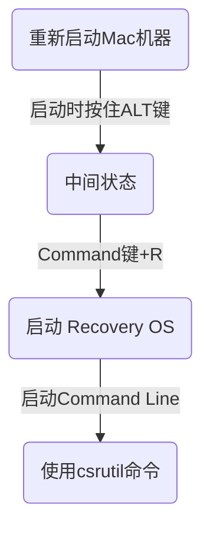

#Mac 加载未签名驱动
##MacOS 10.8之前
MacOS10.8之前是不检查Kext签名的，所以`不做任何处理`就可以加载未签名的Kext
##MacOS 10.9
10.9之后MaxOS会检查Kext的签名，如果Kext没有签名的话系统不能加载。不过可以通过Command Line 来启动开发者模式，就可以加载了
~~~bash
$ sudo nvram boot-args="kext-dev-mode=1"
~~~
##MacOS 10.10之后
10.10之后系统安全性继续增强，结果就是连开发者模式都去掉了。驱动如果希望用户使用就得乖乖地掏出银子给苹果，获得认证开发者资格。
不过我们还是可以在开发阶段绕过签名的，方法就是关掉系统的`System Integrity Protection`

使用`csrutil`命令可以查看、开启、关闭`System Integrity Protection`具体用发如下
```bash
$ csrutil status #查看
System Integrity Protection status: enabled.

$ csrutil enable #开启
$ csrutil disable #关闭
```
使用以上命令需要，重新启动Mac机器进入 Recovery OS，具体方法如下：


需要验证签名机能的时候，别忘了开启`System Integrity Protection`
更改请参考[Apple Developer System Integrity Protection Guide][System Integrity Protection Guide]
[System Integrity Protection Guide]:https://developer.apple.com/library/content/documentation/Security/Conceptual/System_Integrity_Protection_Guide/KernelExtensions/KernelExtensions.html#//apple_ref/doc/uid/TP40016462-CH4-SW1 "System Integrity Protection Guide"